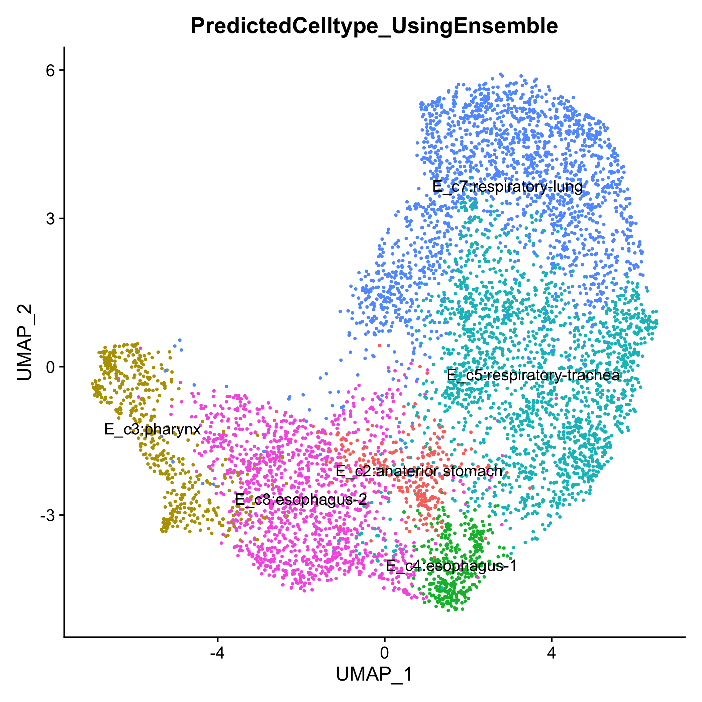
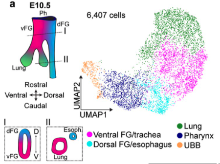
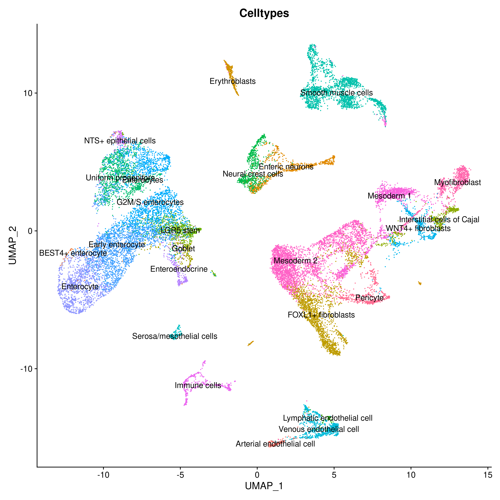
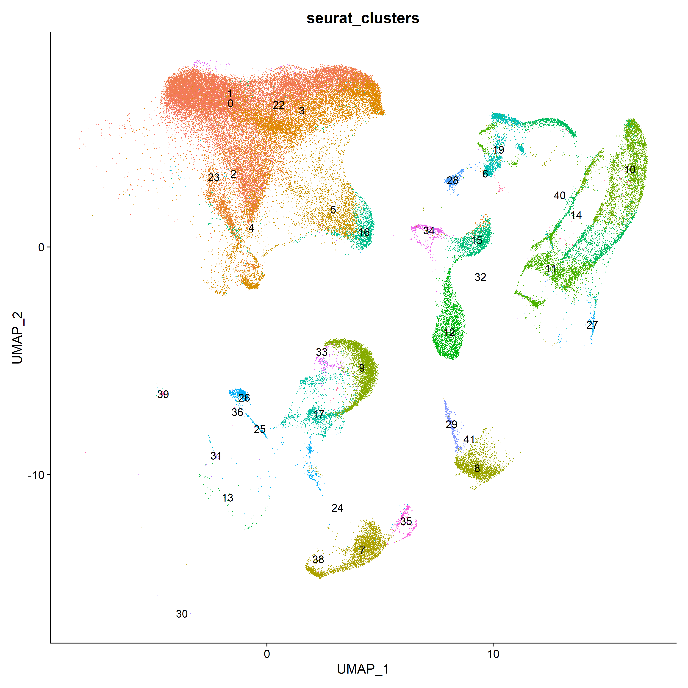
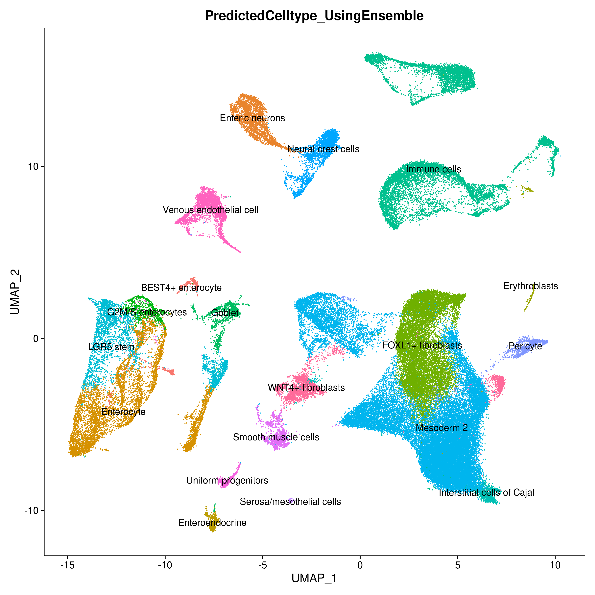

# ELeFHAnt
Ensemble Learning for Harmonization and Annotation of Single Cells (ELeFHAnt) provides an easy to use R package for users to annotate clusters of single cells, harmonize labels across single cell datasets to generate a unified atlas and infer relationship among celltypes between two datasets. It provides users with a flexibility of choosing a machine learning based classifiers or let ELeFHAnt automatically use the power of robust classifiers like randomForest and SVM (Support Vector Machines) to make predictions. It has three functions 1) CelltypeAnnotation 2) LabelHarmonization 3) DeduceRelationship.

## Version 1.1 is now available
1) Bugs are now brushed out
2) A new function to infer relationships among celltypes between scRNA datasets is added [DeduceRelationship]
3) ValidatePrections is now updated and runs a gene set enrichment analysis to check the enrichment of markers from assigned celltypes with respect to markers of seurat_clusters
4) randomForest now builds 1000 trees to train and classify
5) Increased cache memory in SVM
6) cost parameter of SVM is now set to 10 

## Where to find Version 1
Users can still access ELeFHAnt v1 from Releases section of GitHub [https://github.com/praneet1988/ELeFHAnt/releases/tag/version1]

## Installation
```
library(devtools)
devtools::install_github('praneet1988/ELeFHAnt')
library(ELeFHAnt)
```
```
If you encounter problems, try manually installing from the .zip or .tar.gz file with "R CMD INSTALL". 
```

## Developers
```
Praneet Chaturvedi (MS Bioinformatics) : Lead Analyst Bioinformatics, Cincinnati Children's Hospital and Medical Center, Cincinnati, OH - USA

Konrad Thorner (MS Bioinformatics) : Analyst Bioinformatics, Cincinnati Children's Hospital and Medical Center, OH - USA
```

## ELeFHAnt Model


## Random Forest
Random Forests is a powerful tool used extensively across a multitude of field. It is based on generating a large number of decision trees, each constructed using a different subset of your training set. These subsets are usually selected by sampling at random and with replacement from the original data set. The decision trees are then used to identify a classification consensus by selecting the most common output.

## SVM (Support Vector Machines)
SVM is well-established supervised machine learning algorithm. Finds a hyperplane that separates data points into classes, where training occurs through “maximizing the margin”. Training time tends to be longer as data increases. SVM was ranked highly for cell annotation when benchmarked against other tools.

## Ensemble Learning
ELeFHAnt provides users to use ensemble learning for clssifying celltypes for un-annotated cells. In this mode ELeFHAnt uses the clssification accuracy of both Random forest and SVM. It does this by adding weights to the predictions by each classifier. Weights are accuracy that each classifier exhibited during the learning process.

## Celltype Annotation Function
Celltype annotation is a function to annotate celltypes in a single cell datasets. It requires a reference dataset (a processed Seurat Object with Celltypes column in metadata) and a query dataset (a processed seurat object with seurat_clusters column in metadata). One can choose from randomForest, SVM or Ensemble classifiction method to learn celltypes from reference dataset and then predict celltypes for query dataset.

## Label Harmonization Function
Label Harmonization is a function to harmonize cell labels (celltypes) across single cell datasets. It requires a list of processed Seurat Objects with Celltypes column in metadata or a integrated seurat object (seurat object with Celltypes and seurat_clusters column in metadata). One can choose from randomForest, SVM or Ensemble classifiction method.

## Deduce Relationship Function
Deduce Relationship is a function to infer the similarity based relationship between celltypes across single cell datasets. The output is a heatmap that shows which celltype in one reference best corresponds to a celltype in another reference. It requires a two reference datasets (both a processed Seurat Object with Celltypes column in metadata). One can choose from randomForest, SVM or Ensemble classifiction method.


# Celltype Annotation in detail
Celltype annotation is a function to annotate celltypes in a single cell datasets

## Requirements
It requires a reference dataset (a processed Seurat Object with Celltypes column in metadata) and a query dataset (a processed seurat object with seurat_clusters column in metadata). One can choose from randomForest, SVM or Ensemble classifiction method to learn celltypes from reference dataset and then predict celltypes for query dataset.

## How the function works?
### Merge Reference and Query
Merge reference and query into a seurat object
### Normalization
Run Log2 Normalization on the merged object using NormalizeData function in Seurat
### Feature Selection
Obtain highy variable features from the merged data using FindVariableFeatures function in Seurat (default: 2000)
### Scaling
Scale the merged object for highly variable features using ScaleData function in Seurat
### Generate train and test data
Training set is the reference data with celltypes extracted from scaled data. Test set is the query data with seurat_clusters extracted from scaled data.
### Train Classifiers
Training data is used for training randomForest and SVM classifiers.
### Predict Celltypes
Each classifier is after training is then used to classify celltypes for the test data
### Ensemble Learning
Ensemble learning based classsification uses both randomForest and SVM predictions to define final predictions. It does that by assigning weights (accuracy while learning) to the predictions from each classifier. Weighted confusion matrices from each classifier are normalized based on highest number of cells shared among celltypes and assigned clusters which then added together to make Ensemble predictions.

## How to use the function?
### Load Library ELeFHAnt
library(ELeFHAnt)
### Assing parameters in the function
out = CelltypeAnnotation(reference = reference.object, query = mydata.object, downsample = TRUE, downsample_to = 100, classification.method = "Ensemble", crossvalidationSVM = 10, validatePredictions = TRUE, selectvarfeatures = 2000)
## What each parameter is?
```
reference: a processed Seurat Object with Celltypes column in metadata

query: a processed seurat object with seurat_clusters column in metadata

downsample: logical Indicator (TRUE or FALSE) to downsample reference and query enabling fast computation

downsample_to: a numerical value > 1 to downsample cells [Default: 100] in reference and query for Celltypes and seurat_clusters resspectively

classification.method: choose classification method for learning and predicting celltypes. randomForest (decision trees), SVM (Support Vector Machines) or Ensemble (uses estimation robustness of both randomForest and SVM to predict)

crossvalidationSVM: if a integer value k>0 is specified, a k-fold cross validation on the training data is performed to assess the quality of the model

validatePredictions: logical indicator (TRUE or FALSE) to asses predictions by computing number of markers shared between assigned celltype and annotated cluster

selectvarfeatures: number of variable features to select for training (default: 2000)
```
## Output
```
1) query seurat object with predicted celltypes added to metadata of the object
2) Confusion matrices from each classification.method and gene set enrichment results are authomatically saved in the current working directory
```

# Label Harmonization in detail
Label Harmonization is a function to harmonize cell labels (celltypes) across single cell datasets.

## Requirements
It requires a list of processed Seurat Objects with Celltypes column in metadata or a integrated seurat object (integrated seurat object with Celltypes and seurat_clusters column in metadata). One can choose from randomForest, SVM or Ensemble classifiction method to harmonize celltypes. Please see: DefaultAssay of eaach object should be set to "RNA".

## How the function works?
### Integrate seurat objects
Integrate list of seurat objects into an integrated object using Seurat's Canonical Correlation Analysis
### Scaling
Scale integrated data using ScaleData function in Seurat
### Feature Selection
Integration features are set as selected features
### Generate train and test data
Training set and test data is extracted using stratification on scaled integrated data. 60% percent of the data is used as training set and rest of the 40 percent as testing set.
### Train Classifiers
Training data is used for training randomForest and SVM classifiers.
### Harmonize Celltypes
Each classifier after training is then used to classify celltypes for the test data thereby help assign harmonized labels to integration seurat clusters
### Ensemble Learning
Ensemble learning based classsification uses both randomForest and SVM predictions to define final predictions. It does that by assigning weights (accuracy while learning) to the predictions from each classifier. Weighted confusion matrices from each classifier are normalized based on highest number of cells shared among celltypes and assigned clusters which then added together to make Ensemble predictions.

## How to use the function?
### Load Library ELeFHAnt
library(ELeFHAnt)
### Assing parameters in the function
out = LabelHarmonization(seurat.objects = c(seuratbject1, seuratbject2, seuratbject3, ..), perform_integration = TRUE, downsample = TRUE, downsample_to = 100, classification.method = "Ensemble", crossvalidationSVM = 10, validatePredictions = TRUE, integrated.atlas = NULL, npcs = 30, resolution = 0.5, selectanchorfeatures = 2000)

## What each parameter is?
```
seurat.objects: a list of processed seurat objects (DefaultAssay should be set to "RNA") with Celltypes column in their respective meta.data to perform integration on.

perform_integration: logical Indicator (TRUE or FALSE) to perform integration using list of seurat.objects

integrated.atlas: an integrated seurat object with CellTypes and seurat_clusters column in meta.data. Required if: perform_integration = FALSE

downsample: logical Indicator (TRUE or FALSE) to downsample seurat objects enabling fast computation

downsample_to: a numerical value > 1 to downsample cells [Default: 100]

npcs: number of principal components to compute after integration

resolution: value of the resolution parameter, decides size of cell communities.

classification.method: choose classification method for learning and harmonizing celltypes. Choices: randomForest (decision trees), SVM (Support Vector Machines) or Ensemble (uses learning robustness of both randomForest and SVM to predict)

crossvalidationSVM: if a integer value k>0 is specified, a k-fold cross validation on the training data is performed to assess the quality of the model

validatePredictions: logical indicator (TRUE or FALSE) to asses predictions by computing number of markers shared between assigned celltype and annotated cluster

selectanchorfeatures: number of anchor features to use for integrating datasets (Default: 2000)
```
## Output
```
1) integrated seurat object with harmonized celltypes added to metadata of the object
2) Confusion matrices from each classification.method and gene set enrichment results are authomatically saved in the current working directory
```

# Deduce Relationship
Deduce Relationship is a function to infer the similarity based relationship between celltypes across single cell datasets. As the name suggests, any kind of relationship between cell metadata (seurat_clusters, Celltypes, idents etc.) could be determined.
## Requirements
It requires two reference datasets (processed Seurat Object with Celltypes column in metadata). One can choose from randomForest, SVM or Ensemble classifiction method to learn celltypes from reference dataset and find the best corresponding celltypes in the other reference dataset. 

## How the function works?
### Merge Reference1 and Reference2
Merge reference1 and reference2 into a seurat object
### Normalization
Run Log2 Normalization on the merged object using NormalizeData function in Seurat
### Feature Selection
Obtain highy variable features from the merged data using FindVariableFeatures function in Seurat
### Scaling
Scale the merged object for highly variable features using ScaleData function in Seurat
### Generate train and test data
Training set is the reference1 and test set is the reference2 extracted from scaled data
### Train Classifiers
Training data is used for training randomForest and SVM classifiers.
### Infer Relationship
Each classifier is after training is then used to infer relationship among celltypes between reference1 and reference2
### Ensemble Learning
Ensemble learning based classsification uses both randomForest and SVM predictions to infer relationship among celltypes between reference1 and reference2. It does that by assigning weights (accuracy while learning) to the predictions from each classifier. Weighted confusion matrices from each classifier are normalized based on highest number of cells shared among celltypes and assigned clusters which then added together to make Ensemble predictions.

## How to use the function?
### Load Library ELeFHAnt
library(ELeFHAnt)
### Assing parameters in the function
out = DeduceRelationship(reference1 = NULL, reference2 = NULL, downsample = TRUE, downsample_to = 100, classification.method = "Ensemble", crossvalidationSVM = 5, selectvarfeatures = 2000)

## What each parameter is?
```
reference1: a processed Seurat Object with Celltypes column in metadata

reference2: a processed seurat object with Celltypes column in metadata

downsample: logical Indicator (TRUE or FALSE) to downsample reference and query enabling fast computation

downsample_to: a numerical value > 1 to downsample cells [Default: 100] in reference and query for Celltypes and seurat_clusters resspectively

classification.method: choose classification method for learning and predicting celltypes. randomForest (decision trees), SVM (Support Vector Machines) or Ensemble (uses estimation robustness of both randomForest and SVM to predict)

crossvalidationSVM: if a integer value k>0 is specified, a k-fold cross validation on the training data is performed to assess the quality of the model

selectvarfeatures: number of variable features to select while training (default: 2000)
```
## Output
```
1) ggplot2 heatmap object
2) Confusion Matrices from each classification.method and heatmaps are automatically saved in current working directory
```

# ELeFHAnt Reference datasets as plugins
Download pre-processed reference datasets for Celltype Annotation, Label Harmonization or DeduceRelationship: https://www.dropbox.com/sh/6hd2skriqqlokwp/AAAVol-_qPlCdA4DpERWjkeJa?dl=0

# Celltype Annotation Example
## Example1
To demonstrate  Celltype Annotation: reference was set ForegutEnoderm mouse from E8.5 to E9.5 (https://www.nature.com/articles/s41467-020-17968-x) and query was set to foregut endoderm cells from E10.5 (https://elifesciences.org/articles/55526). No downsampling was performed.

### Predicted celltypes for query using Ensemble learning


We were successful at automating annotating celltypes in dataset coming from a later stage. Below is the celltype annotation from publication https://elifesciences.org/articles/55526



We see great consensus in celltype annotation.

## Example2
To further demostrate Celltype Annotation using ELeFHAnt we used Gut Cell Atlas(https://cellgeni.cog.sanger.ac.uk/gutcellatlas/fetal_RAWCOUNTS_cellxgene.h5ad) as reference and Fetal intestinal data (https://www.sciencedirect.com/science/article/pii/S0092867421005316) from Dr. Spence Lab as query. Reference and query were downsampled to 200 cells per Celltypes and seurat_clusters respectively for enabling fast computation.

### GutCell data as Reference


### Fetal Intestine (Dr. Spence's Lab) as Query


### Predicted celltypes for query using Ensemble learning



# Label Harmonization Example
To demonstrate LabelHarmonization we used three datasets: 1) Gut Cell Atlas(https://cellgeni.cog.sanger.ac.uk/gutcellatlas/fetal_RAWCOUNTS_cellxgene.h5ad) 2) Fetal intestinal data (https://www.sciencedirect.com/science/article/pii/S0092867421005316) from Dr. Spence's Lab 3) Fetal intestine data from STAR-FINDer (https://www.sciencedirect.com/science/article/pii/S009286742031686X). Data shown below is based on subsetting 200 cells per celltype in each dataset to harmonize atlas consisting of ~125k cells.

### Harmonized Atlas ~125k cells


We can clearly see that after integration showing Celltypes from each dataset on UMAP is very difficult to interpret whereas using LabelHarmonization from ELeFHAnt each cluster after integration has a clear celltype assignment and making it easy to infer.

# Deduce Relationship Example
To demonstrate Deduce Relationship we used two datasets that were also uses in the harmonization example: 1) Gut Cell Atlas(https://cellgeni.cog.sanger.ac.uk/gutcellatlas/fetal_RAWCOUNTS_cellxgene.h5ad) 2) Fetal intestinal data (https://www.sciencedirect.com/science/article/pii/S0092867421005316) from Dr. Spence's Lab. Data shown below is based on subsetting to 500 cells per celltype in each dataset.

### Relationship among celltypes between two datasets


The output of Deduce Relationship is a representation of the confusion matrix as a heatmap, with each square signifying how many cells of a given celltype in one reference were classified as a celltype in the other. It is normalized in such a way that each celltype in reference 2 has a red square that shows the most closely related celltype in reference 1. We can see that the related celltypes all make biological sense, in particular all immune cells being assigned to "Immune cells", and the mesenchyme subtypes being assigned to "Mesoderm 2". 

# Reproducibility
To assess reproducibility, each function was run 5 times with varying numbers of cells used during subsampling, ranging from 100 to 500. This will also determine what number of examples during training leads to the best performance for the SVM and Random Forest classifers.

For Celltype Annotation, the predicted cell labels assigned to the query differ for 100 cells but remain stable when 200 to 500 cells are subsampled.
Following datasets were used. Gut Cell Atlas(https://cellgeni.cog.sanger.ac.uk/gutcellatlas/fetal_RAWCOUNTS_cellxgene.h5ad) as reference and Fetal intestinal data (https://www.sciencedirect.com/science/article/pii/S0092867421005316) from Dr. Spence Lab as query

### Celltype Predictions using 100, 300 and 500 cells per Celltypes resepctively


For Label Harmonization, we find that cell labels remain approximately 80% consistent across the different iterations. Relative to annotation, the complexity from the number of datasets and cell labels suggests that harmonization does benefit from a greater number of cells used. Following datasets were used: 1) Gut Cell Atlas(https://cellgeni.cog.sanger.ac.uk/gutcellatlas/fetal_RAWCOUNTS_cellxgene.h5ad) 2) Fetal intestinal data (https://www.sciencedirect.com/science/article/pii/S0092867421005316) from Dr. Spence's Lab 3) Fetal intestine data from STAR-FINDer (https://www.sciencedirect.com/science/article/pii/S009286742031686X)

### Celltype harmonization using 100, 300 and 500 cells per Celltypes respectively


Lastly, for Deduce Relationship, the heatmaps display little variability even between subsamples of 100 and 500. Following datasets were used: Gut Cell Atlas(https://cellgeni.cog.sanger.ac.uk/gutcellatlas/fetal_RAWCOUNTS_cellxgene.h5ad) as reference1 and Fetal intestinal data (https://www.sciencedirect.com/science/article/pii/S0092867421005316) from Dr. Spence Lab as reference2

### Inferring relationships across Celltypes using 100, 300 and 500 Celltypes between datasets


# Citation
Please cite github page if using for research purposes (https://github.com/praneet1988/ELeFHAnt)

# Bugs/Issues
Please report bugs, issues and improvements using the issues section of github.
