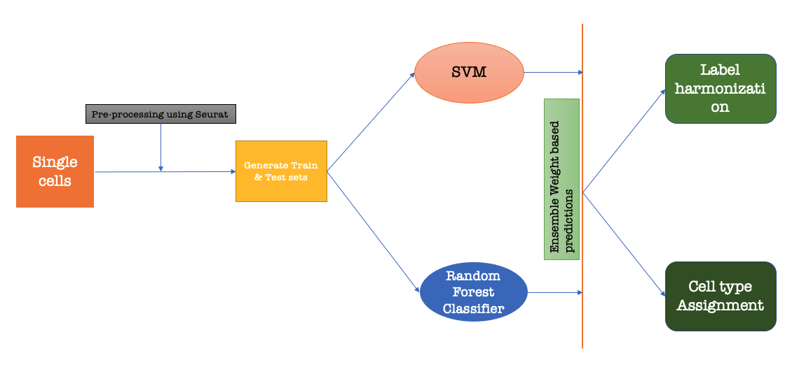
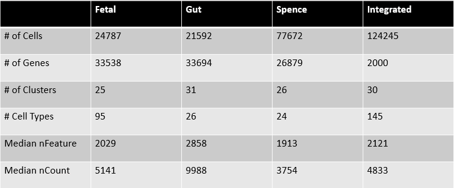
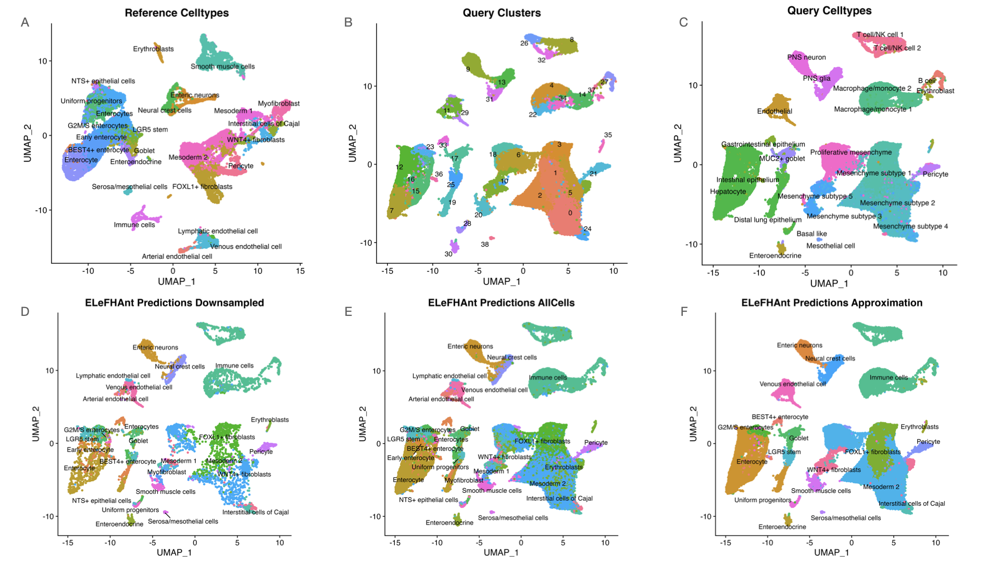
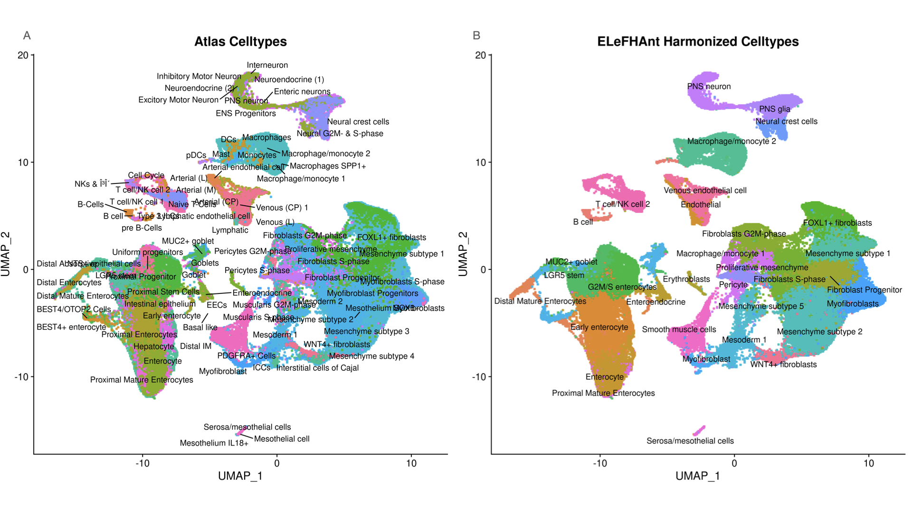
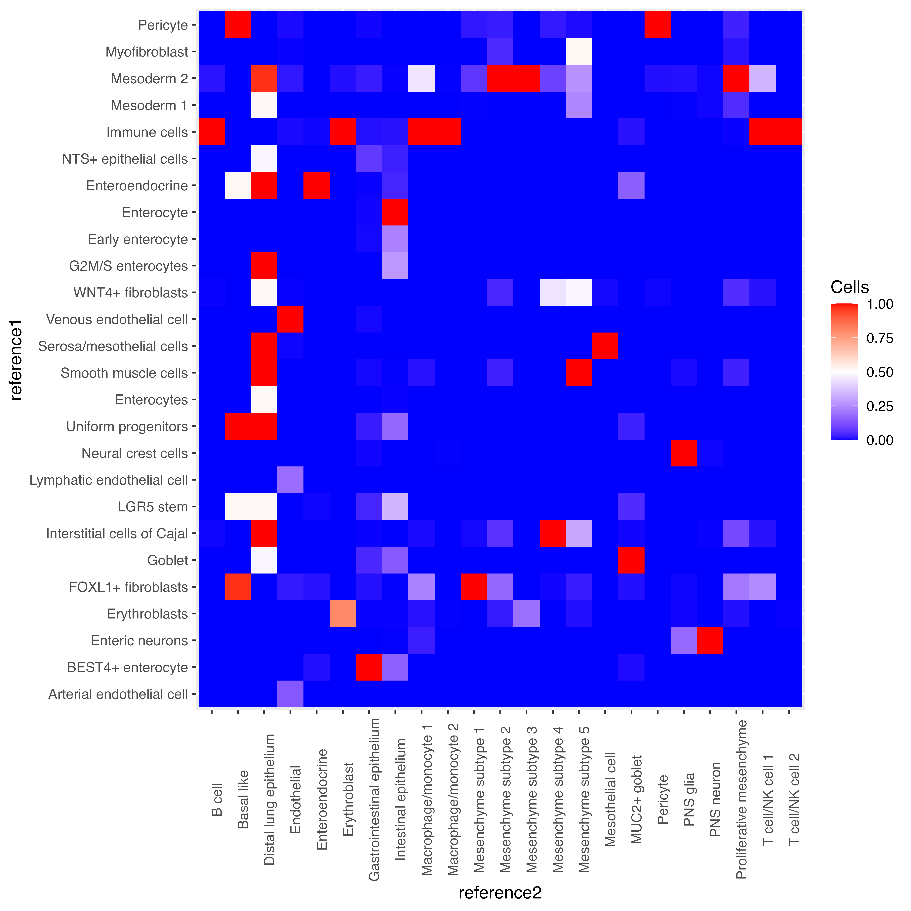
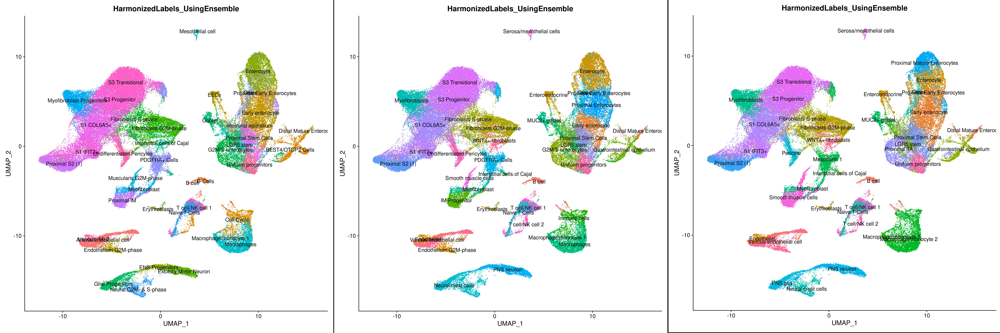
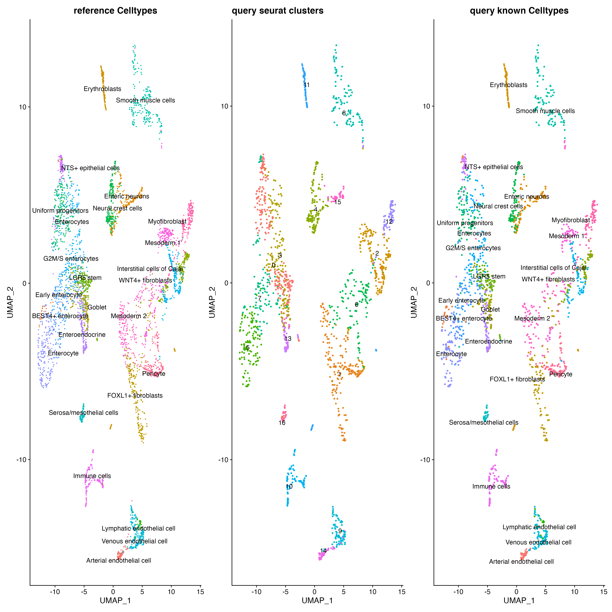
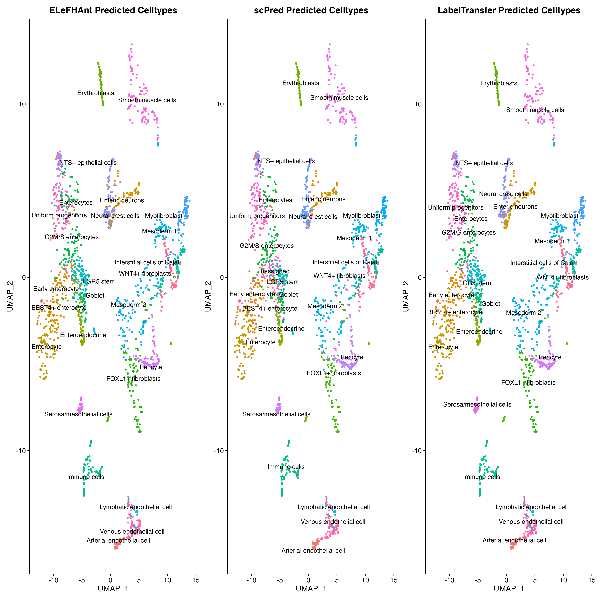
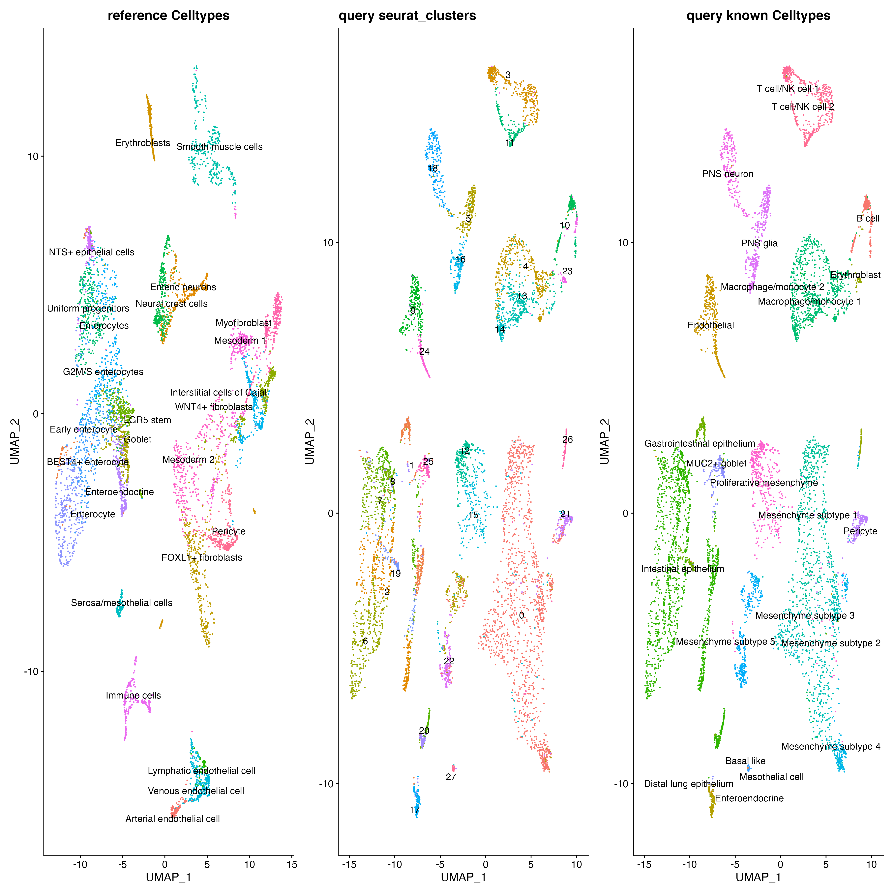
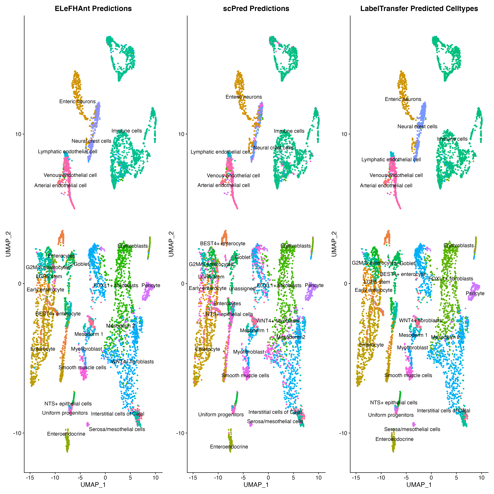

[](https://github.com/praneet1988/ELeFHAnt)
[]()

# ELeFHAnt
Ensemble Learning for Harmonization and Annotation of Single Cells (ELeFHAnt) provides an easy to use R package for users to annotate clusters of single cells, harmonize labels across single cell datasets to generate a unified atlas and infer relationship among celltypes between two datasets. It provides users with the flexibility of choosing a single machine learning based classifier or letting ELeFHAnt automatically use the power of  randomForest and SVM (Support Vector Machines) to make predictions. It has three functions 1) CelltypeAnnotation 2) LabelHarmonization 3) DeduceRelationship.

## Version 1.1.2 is now available
Improved CelltypeAnnotation function. Users can now choose the classification approach that ELeFHAnt should apply. 1) ClassifyCells 2) ClassifyCells_usingApproximation. We recommend using ClassifyCells_usingApproximation when reference has significantly less number of cells compared to query

## Where to find previous versions
Users can access ELeFHAnt previous releases from Releases section of GitHub [https://github.com/praneet1988/ELeFHAnt/releases]

## Installation
```
library(devtools)
devtools::install_github('praneet1988/ELeFHAnt')
library(ELeFHAnt)
```
```
If you encounter any problems, try manually installing from the .zip or .tar.gz file with "R CMD INSTALL". 
```

## Developers
```
Praneet Chaturvedi (MS Bioinformatics) : Lead Analyst Bioinformatics, Cincinnati Children's Hospital and Medical Center, Cincinnati, OH - USA
GitHub Username: praneet1988

Konrad Thorner (MS Bioinformatics) : Analyst Bioinformatics, Cincinnati Children's Hospital and Medical Center, OH - USA
GitHub Username: kthorner
```

## ELeFHAnt Model


## Random Forest
Random Forests is a powerful tool used extensively across a multitude of fields. It is based on generating a large number of decision trees, each constructed using a different subset of your training set. These subsets are usually selected by sampling at random and with replacement from the original data set. The decision trees are then used to identify a classification consensus by selecting the most common output.

## SVM (Support Vector Machines)
SVM is a well-established supervised machine learning algorithm. It finds a hyperplane that separates data points into classes, where training occurs through “maximizing the margin”. Training time tends to be longer as data increases. SVM was ranked highly for cell annotation when benchmarked against other tools.

## Ensemble Learning
ELeFHAnt provides users the ability to use ensemble learning for classifying celltypes for un-annotated datasets. In this mode ELeFHAnt uses the classification accuracy of both Random forest and SVM. It does so by assigning weights (accuracy while learning) to the predictions from each classifier. Weighted confusion matrices from each classifier are normalized based on highest number of cells shared among celltypes and assigned clusters, which are then added together to make the final ensemble predictions.

## Celltype Annotation Function
Celltype annotation is a function used to annotate celltypes in single cell datasets. It requires a reference dataset (a processed Seurat Object with Celltypes column in metadata) and a query dataset (a processed seurat object with seurat_clusters column in metadata). One can choose from randomForest, SVM or Ensemble classifiction methods to learn celltypes from the reference dataset and then predict celltypes for query dataset.

## Label Harmonization Function
Label Harmonization is a function used to harmonize cell labels (celltypes) across single cell datasets. It requires a list of processed Seurat Objects with a Celltypes column in metadata or an integrated seurat object (seurat object with Celltypes and seurat_clusters columns in the metadata). One can choose from randomForest, SVM or Ensemble classifiction methods.

## Deduce Relationship Function
Deduce Relationship is a function used to infer the similarity between celltypes across single cell datasets. The output is a heatmap that shows which celltype in one reference best corresponds to a celltype in another reference. It requires two reference datasets (both processed Seurat Objects with Celltypes columns in the metadata). One can choose from randomForest, SVM or Ensemble classifiction methods.

# Celltype Annotation in detail
Celltype annotation is a function to annotate celltypes in single cell datasets.

## Requirements
It requires a reference dataset (a processed Seurat Object with Celltypes column in the metadata) and a query dataset (a processed Seurat object with seurat_clusters column in the metadata). One can choose from randomForest, SVM or Ensemble classifiction methods to learn celltypes from the reference dataset and then predict celltypes for the query dataset.

## How does the function work?
### Merge Reference and Query
Merge reference and query into a Seurat object.
### Normalization
Run Log2 Normalization on the merged object using NormalizeData function in Seurat.
### Feature Selection
Obtain highly variable features from the merged data using FindVariableFeatures function in Seurat (default: 2000).
### Scaling
Scale the merged object for highly variable features using ScaleData function in Seurat.
### Generate train and test data
Training set is the reference data with celltypes extracted from scaled data. Test set is the query data with seurat_clusters extracted from scaled data.
### Train Classifiers
Training data is used for training randomForest and SVM classifiers.
### Predict Celltypes
Each classifier after training is then used to classify celltypes for the test data.
### Ensemble Learning
Ensemble learning based classsification uses both randomForest and SVM predictions to define final predictions. It does that by assigning weights (the accuracy while learning) to the predictions from each classifier. Weighted confusion matrices from each classifier are normalized based on highest number of cells shared among celltypes and assigned clusters, which are then added together to make the final ensemble predictions.

## How to use the function?
### Load Library ELeFHAnt
library(ELeFHAnt)
### Assing parameters in the function
out = CelltypeAnnotation(reference = reference.object, query = mydata.object, downsample = FALSE, downsample_to = 100, classification.method = "Ensemble", crossvalidationSVM = 10, validatePredictions = TRUE, selectvarfeatures = 2000, ntree = 500, classification.approach = "ClassifyCells")
## What does each parameter do?
```
reference: a processed Seurat object with Celltypes column in the metadata

query: a processed Seurat object with seurat_clusters column in the metadata

downsample: logical Indicator (TRUE or FALSE) to downsample reference, enabling fast computation. if classification.approach is set to "ClassifyCells_usingApproximation" query will be downsampled along with reference.

downsample_to: a numerical value > 1 to downsample cells [Default: 100] in reference and query for Celltypes and seurat_clusters respectively

classification.method: choose classification method for learning and predicting celltypes. randomForest (decision trees), SVM (Support Vector Machines) or Ensemble (uses estimation robustness of both randomForest and SVM to predict)

crossvalidationSVM: if a integer value k>0 is specified, a k-fold cross validation on the training data is performed to assess the quality of the model

validatePredictions: logical indicator (TRUE or FALSE) to assess predictions by computing number of markers shared between assigned celltype and annotated cluster

selectvarfeatures: number of variable features to select for training (default: 2000)

ntree: number of trees randomForest classifier should build (Default: 500)

classification.approach: apprach to classify cells 1) ClassifyCells 2) ClassifyCells_usingApproximation. Default: ClassifyCells. We recommend using ClassifyCells_usingApproximation when reference has significantly less number of cells compared to query
```
## Output
```
1) query Seurat object with predicted celltypes added to metadata of the object
2) Confusion matrices from each classification.method (when classification.apprach is set to ClassifyCells_usingApproximation) and gene set enrichment results are automatically saved in the current working directory
```

# Label Harmonization in detail
Label Harmonization is a function to harmonize cell labels (celltypes) across single cell datasets.

## Requirements
It requires a list of processed Seurat objects with a Celltypes column in the metadata or an integrated Seurat object (integrated Seurat object with Celltypes and seurat_clusters columns in the metadata). One can choose from randomForest, SVM or Ensemble classifiction methods to harmonize celltypes. Please note: DefaultAssay of each object should be set to "RNA".

## How does the function work?
### Integrate Seurat objects
Integrate list of Seurat objects into an integrated object using Seurat's Canonical Correlation Analysis.
### Scaling
Scale integrated data using ScaleData function in Seurat.
### Feature Selection
Integration features are set as selected features.
### Generate train and test data
Training set and test data are extracted using stratification on scaled integrated data. 60% of the data is used as training set and the remaining 40% is used as the testing set.
### Train Classifiers
Training data is used for training randomForest and SVM classifiers.
### Harmonize Celltypes
Each classifier after training is used to classify celltypes for the test data, thereby assignig harmonized labels to the integrated Seurat clusters.
### Ensemble Learning
Ensemble learning based classsification uses both randomForest and SVM predictions to define final predictions. It does so by assigning weights (accuracy while learning) to the predictions from each classifier. Weighted confusion matrices from each classifier are normalized based on highest number of cells shared among celltypes and assigned clusters, which are then added together to make the final ensemble predictions.

## How to use the function?
### Load Library ELeFHAnt
library(ELeFHAnt)
### Assing parameters in the function
out = LabelHarmonization(seurat.objects = c(seuratbject1, seuratbject2, seuratbject3, ..), perform_integration = TRUE, downsample = TRUE, downsample_to = 500, classification.method = "Ensemble", crossvalidationSVM = 10, validatePredictions = TRUE, integrated.atlas = NULL, npcs = 30, resolution = 0.5, selectanchorfeatures = 2000, ntree = 500)

## What does each parameter do?
```
seurat.objects: a list of processed Seurat objects (DefaultAssay should be set to "RNA") with a Celltypes column in their respective meta.data to perform integration on

perform_integration: logical Indicator (TRUE or FALSE) to perform integration using list of seurat.objects

integrated.atlas: an integrated Seurat object with CellTypes and seurat_clusters column in meta.data. Required if: perform_integration = FALSE

downsample: logical Indicator (TRUE or FALSE) to downsample Seurat objects or integrated seurat object, enabling fast computation

downsample_to: a numerical value > 1 to downsample cells [Default: 100]

npcs: number of principal components to compute after integration

resolution: value of the resolution parameter, decides size of cell communities

classification.method: choose classification method for learning and harmonizing celltypes. Choices: randomForest (decision trees), SVM (Support Vector Machines) or Ensemble (uses learning robustness of both randomForest and SVM to predict)

crossvalidationSVM: if a integer value k>0 is specified, a k-fold cross validation on the training data is performed to assess the quality of the model

validatePredictions: logical indicator (TRUE or FALSE) to assess predictions by computing number of markers shared between assigned celltype and annotated cluster

selectanchorfeatures: number of anchor features to use for integrating datasets (Default: 2000)

ntree: number of trees randomForest classifier should build (Default: 500)
```
## Output
```
1) Integrated Seurat object with harmonized celltypes added to metadata of the object
2) Confusion matrices from each classification.method and gene set enrichment results (if validatePredictions = TRUE) are automatically saved in the current working directory
```

# Deduce Relationship
Deduce Relationship is a function used primarily to infer the similarity between celltypes across single cell datasets. As the name suggests, any kind of relationship between cell metadata (seurat_clusters, Celltypes, idents etc.) could also be determined.
## Requirements
It requires two reference datasets (processed Seurat Object with Celltypes column in the metadata). One can choose from randomForest, SVM or Ensemble classifiction methods to learn celltypes from the reference dataset and find the best corresponding celltypes in the other reference dataset. 

## How does the function work?
### Merge Reference1 and Reference2
Merge reference1 and reference2 into a Seurat object.
### Normalization
Run Log2 Normalization on the merged object using NormalizeData function in Seurat.
### Feature Selection
Obtain highly variable features from the merged data using FindVariableFeatures function in Seurat.
### Scaling
Scale the merged object for highly variable features using ScaleData function in Seurat.
### Generate train and test data
Training set is reference1 and test set is reference2, extracted from scaled data.
### Train Classifiers
Training data is used for training the randomForest and SVM classifiers.
### Infer Relationship
Each classifier after training is used to infer the relationship among celltypes between reference1 and reference2.
### Ensemble Learning
Ensemble learning based classsification uses both randomForest and SVM predictions to infer the relationship among celltypes between reference1 and reference2. It does so by assigning weights (accuracy while learning) to the predictions from each classifier. Weighted confusion matrices from each classifier are normalized based on the highest number of cells shared among celltypes and assigned clusters, which are then added together to make the final ensemble predictions.

## How to use the function?
### Load Library ELeFHAnt
library(ELeFHAnt)
### Assing parameters in the function
out = DeduceRelationship(reference1 = NULL, reference2 = NULL, downsample = TRUE, downsample_to = 100, classification.method = "Ensemble", crossvalidationSVM = 5, selectvarfeatures = 2000)

## What does each parameter do?
```
reference1: a processed Seurat object with Celltypes column in the metadata

reference2: a processed Seurat object with Celltypes column in the metadata

downsample: logical Indicator (TRUE or FALSE) to downsample reference1 and reference2, enabling fast computation

downsample_to: a numerical value > 1 to downsample cells [Default: 100] in reference and query for Celltypes and seurat_clusters respectively

classification.method: choose classification method for learning and predicting celltypes. randomForest (decision trees), SVM (Support Vector Machines) or Ensemble (uses estimation robustness of both randomForest and SVM to predict)

crossvalidationSVM: if a integer value k>0 is specified, a k-fold cross validation on the training data is performed to assess the quality of the model

selectvarfeatures: number of variable features to select while training (default: 2000)

ntree: number of trees randomForest classifier should build (Default: 500)
```
## Output
```
1) a ggplot2 heatmap object
2) Confusion matrices from each classification.method and heatmap are automatically saved in current working directory
```

# ELeFHAnt Reference datasets as plugins
Download pre-processed reference datasets for Celltype Annotation, Label Harmonization or DeduceRelationship here: https://www.dropbox.com/sh/6hd2skriqqlokwp/AAAVol-_qPlCdA4DpERWjkeJa?dl=0

# Datasets used to showcase ELeFHAnt functionalities
To demonstrate all the functions of ELeFHAnt we utilize three datasets of early gut development as shown below, as well as an integrated dataset of all three. "GSE158702" refers to a subset of terminal ileum (TI) data from an atlas for human fetal intestinal development called "STAR-FINDer" (https://www.sciencedirect.com/science/article/pii/S009286742031686X). "E-MTAB-8901" refers to a subset of duojejunum cell data from the Gut Cell Atlas, which also examines intestinal development from 6-10 weeks post-conception (https://www.sciencedirect.com/science/article/pii/S1534580720308868). Lastly, "E-MTAB-10187" refers a subset of fetal intestinal data from a multi-endodermal organ atlas (https://www.sciencedirect.com/science/article/pii/S0092867421005316). 


  
# Celltype Annotation Example

To demostrate Celltype Annotation using ELeFHAnt we used E-MTAB-8901 (~21k cells) as the reference and E-MTAB-10187 (~77k cells) as the query. We used three scenarios 1) Reference was downsampled to 300 cells per celltype and query was downsampled to 200 cells per seurat_cluster. classiification.approach was set to "ClassifyCells" [Downsampled] 2) using all cells in reference and query. classiification.approach was set to "ClassifyCells" [All cells] and 3) using all cells in reference and query but setting using classification.approach = "ClassifyCells_usingApproximation" and downsample = 300 [Approximation]

### ELeFHAnt Celltype Anntation



# Label Harmonization Example
To demonstrate LabelHarmonization we used three datasets: 1) E-MTAB-8901 (~21k cells) 2) E-MTAB-10187 (~77k cells) 3) GSE158702 (~20k cells). We integrated three datasets using Seurat's CCA based integration and then ran Label Harmonization (downsample = TRUE, downsample_to = 500) on the integrated object (~112k cells). Left panel shows all ~120 cell labels whereas right panel shows 33 granular cell labels assigned after harmonization.
  
### Harmonized Atlas ~112k cells


# Deduce Relationship Example
To demonstrate Deduce Relationship we used two datasets that were also uses in the harmonization example: 1) E-MTAB-8901 (~21k cells) 2) E-MTAB-10187 (~77k cells). Parameters used: downsample = TRUE, downsample_to=300, classification.method="Ensemble"

### Relative Similarity among celltypes between two datasets


The output of Deduce Relationship is a representation of the confusion matrix as a heatmap, with each square signifying how many cells of a given celltype in one reference were classified as a celltype in the other. It is normalized in such a way that each celltype in reference 2 has a red square that shows the most closely related celltype in reference 1. We see that the related celltypes all make biological sense, such as all immune cells and their subtypes in reference2 being assigned to "Immune cells" reference1, and similarly mesenchyme subtypes being assigned to "Mesoderm 2".
  
# Tutorials
Please download the tutorials in .html or .Rmd format using the following link: https://www.dropbox.com/sh/rky0q5vf8oo7d6t/AAC0_fG5GQVdqldIIP2rWV49a?dl=0


# Reproducibility
To assess reproducibility, each function was run 3 times with varying numbers of cells used during subsampling, ranging from 100, 300 and 500. This helps determine what number of examples during training leads to the best performance for the SVM and Random Forest classifers.

For Celltype Annotation, the predicted cell labels assigned to the query differ for 100 cells but remain stable when 300 to 500 cells are subsampled.
The following datasets were used: E-MTAB-8901 (~21k cells) as reference and E-MTAB-10187 (~77k cells) as query. Classification.approach is set to "ClassifyCells_usingApproximation".

### Celltype Predictions using 100, 300 and 500 cells per Celltypes resepctively


For Label Harmonization, we find that cell labels remain approximately 80% consistent across the different iterations. Relative to annotation, the complexity from the number of datasets and cell labels suggests that harmonization does benefit from a greater number of cells used. The following datasets were used: 1) E-MTAB-8901 (~21k cells) 2) E-MTAB-10187 (~77k cells) 3) GSE158702 (~20k cells)

### Celltype harmonization using 100, 300 and 500 cells per Celltypes respectively


Lastly, for Deduce Relationship, the heatmaps display little variability even between subsamples of 100, 300 and 500. The following datasets were used: E-MTAB-8901 (~21k cells) as reference1 and E-MTAB-10187 (~77k cells) as reference2.

### Inferring relationships across Celltypes using 100, 300 and 500 Celltypes between datasets

  
# Benchmarking
To assess the performance of ELeFHAnt, we compared it to some readily used R packages like scPred and Seurat's label transfer. We could only comapre CelltypeAnnotation function as this is the only common function acrosss three packages.
We performed benchmarking in two ways 1) Intra dataset 2) Inter dataset. For Intra dataset we used downsampled E-MTAB-8901 (~21k cells). 70% cells were used for training and 30% for testing. For Inter dataset we used E-MTAB-8901 (~21k cells) as reference and E-MTAB-10187 (~77k cells) as query. 300 cells per Cell type were used from E-MTAB-8901 and 200 cells per seurat_cluster were used from E-MTAB-10187. Classification.apprach was set to "ClassifyCells".

### Intra dataset Benchmarking


  
### Inter dataset Benchmarking



# Citation
Please cite our preprint: https://www.biorxiv.org/content/10.1101/2021.09.07.459342v1 when using ELeFHAnt in your research.

# Bugs/Issues
Please report bugs, issues and improvements using the issues section of the GitHub page.

# Contribute to Code
Please open a pull request to contribute to existing code in terms of improvements / new features / bug removal.
