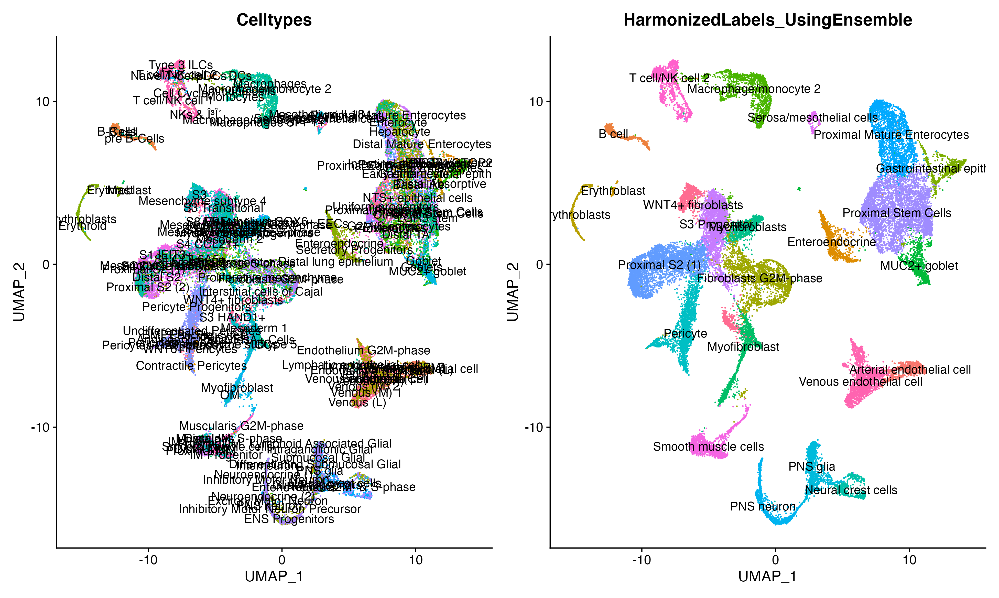

# ELeFHAnt
Ensemble Learning for Harmonization and Annotation of Single Cells (ELeFHAnt) provides an easy to use R package for users to annotate clusters of single cells and harmonize labels across single cell datasets to generate a unified atlas. It provides users with a flexibility of choosing a machine learning based classifiers or let ELeFHAnt automatically use the power of robust classifiers like randomForest and SVM (Support Vector Machines) to make predictions. It has two functions 1) CelltypeAnnotation 2) LabelHarmonization.

## Installation
```
library(devtools)
devtools::install_github('praneet1988/ELeFHAnt')
library(ELeFHAnt)
```
If you encounter problems, try manually installing from the .zip or .tar.gz file with "R CMD INSTALL". 

## Developers
```
Praneet Chaturvedi (MS Bioinformatics) : Lead Analyst Bioinformatics, Cincinnati Children's Hospital and Medical Center, Cincinnati, OH - USA

Konrad Thorner (MS Bioinformatics) : Analyst Bioinformatics, Cincinnati Children's Hospital and Medical Center, OH - USA
```

## ELeFHAnt Model


## Random Forest
Random Forests is a powerful tool used extensively across a multitude of field. It is based on generating a large number of decision trees, each constructed using a different subset of your training set. These subsets are usually selected by sampling at random and with replacement from the original data set. The decision trees are then used to identify a classification consensus by selecting the most common output.

## SVM (Support Vector Machines)
SVM is well-established supervised machine learning algorithm. Finds a hyperplane that separates data points into classes, where training occurs through “maximizing the margin”. Training time tends to be longer as data increases. SVM was ranked highly for cell annotation when benchmarked against other tools.

## Ensemble Learning
ELeFHAnt provides users to use ensemble learning for clssifying celltypes for un-annotated cells. In this mode ELeFHAnt uses the clssification accuracy of both Random forest and SVM. It does this by adding weights to the predictions by each classifier. Weights are accuracy that each classifier exhibited during the learning process.

## Celltype Annotation Function
Celltype annotation is a function to annotate celltypes in a single cell datasets. It requires a reference dataset (a processed Seurat Object with Celltypes column in metadata) and a query dataset (a processed seurat object with seurat_clusters column in metadata). One can choose from randomForest, SVM or Ensemble classifiction method to learn celltypes from reference dataset and then predict celltypes for query dataset.

## Label Harmonization Function
Label Harmonization is a function to harmonize cell labels (celltypes) across single cell datasets. It requires a list of processed Seurat Objects with Celltypes column in metadata or a integrated seurat object (seurat object with Celltypes and seurat_clusters column in metadata). One can choose from randomForest, SVM or Ensemble classifiction method.

# Celltype Annotation
Celltype annotation is a function to annotate celltypes in a single cell datasets

## Requirements
It requires a reference dataset (a processed Seurat Object with Celltypes column in metadata) and a query dataset (a processed seurat object with seurat_clusters column in metadata). One can choose from randomForest, SVM or Ensemble classifiction method to learn celltypes from reference dataset and then predict celltypes for query dataset.

## How the function works?
### Merge Reference and Query
Merge reference and query into a seurat object
### Normalization
Run Log2 Normalization on the merged object using NormalizeData function in Seurat
### Feature Selection
Obtain highy variable features from the merged data using FindVariableFeatures function in Seurat
### Scaling
Scale the merged object for highly variable features using ScaleData function in Seurat
### Generate train and test data
Training set is the reference data with celltypes extracted from scaled data. Test set is the query data with seurat_clusters extracted from scaled data.
### Train Classifiers
Training data is used for training randomForest and SVM classifiers.
### Predict Celltypes
Each classifier is after training is then used to classify celltypes for the test data
### Ensemble Learning
Ensemble learning based classsification uses both randomForest and SVM predictions to define final predictions. It does that by assigning weights (accuracy while learning) to the predictions from each classifier

## How to use the function?
### Load Library ELeFHAnt
library(ELeFHAnt)
### Assing parameters in the function
CelltypeAnnotation(reference=reference.object, query=mydata.object, downsample=TRUE, downsample_to = 100, classification.method = "Ensemble", crossvalidationSVM = 10, validatePredictions = TRUE)
## What each parameter is?
```
reference: a processed Seurat Object with Celltypes column in metadata

query: a processed seurat object with seurat_clusters column in metadata

downsample: logical Indicator (TRUE or FALSE) to downsample reference and query enabling fast computation

downsample_to: a numerical value > 1 to downsample cells [Default: 100] in reference and query for Celltypes and seurat_clusters resspectively

classification.method: choose classification method for learning and predicting celltypes. randomForest (decision trees), SVM (Support Vector Machines) or Ensemble (uses estimation robustness of both randomForest and SVM to predict)

crossvalidationSVM: if a integer value k>0 is specified, a k-fold cross validation on the training data is performed to assess the quality of the model

validatePredictions: logical indicator (TRUE or FALSE) to asses predictions by computing number of markers shared between assigned celltype and annotated cluster
```
# Label Harmonization
Label Harmonization is a function to harmonize cell labels (celltypes) across single cell datasets.

## Requirements
It requires a list of processed Seurat Objects with Celltypes column in metadata or a integrated seurat object (integrated seurat object with Celltypes and seurat_clusters column in metadata). One can choose from randomForest, SVM or Ensemble classifiction method to harmonize celltypes. Please see: DefaultAssay of eaach object should be set to "RNA".

## How the function works?
### Integrate seurat objects
Integrate list of seurat objects into an integrated object using Seurat's Canonical Correlation Analysis
### Scaling
Scale integrated data using ScaleData function in Seurat
### Feature Selection
Integration features are set as selected features
### Generate train and test data
Training set and test data is extracted using stratification on scaled integrated data. 60% percent of the data is used as training set and rest of the 40 percent as testing set.
### Train Classifiers
Training data is used for training randomForest and SVM classifiers.
### Harmonize Celltypes
Each classifier after training is then used to classify celltypes for the test data thereby help assign harmonized labels to integration seurat clusters
### Ensemble Learning
Ensemble learning based classsification uses both randomForest and SVM predictions to define final predictions. It does that by assigning weights (accuracy while learning) to the predictions from each classifier

## How to use the function?
### Load Library ELeFHAnt
library(ELeFHAnt)
### Assing parameters in the function
LabelHarmonization(seurat.objects = c(seuratbject1, seuratbject2, seuratbject3, ..), perform_integration = TRUE, downsample = TRUE, downsample_to = 100, classification.method = "Ensemble", crossvalidationSVM = 10, validatePredictions = TRUE, integrated.atlas = NULL, npcs = 30, resolution = 0.5)

## What each parameter is?
```
seurat.objects: a list of processed seurat objects (DefaultAssay should be set to "RNA") with Celltypes column in their respective meta.data to perform integration on.

perform_integration: logical Indicator (TRUE or FALSE) to perform integration using list of seurat.objects

integrated.atlas: an integrated seurat object with CellTypes and seurat_clusters column in meta.data. Required if: perform_integration = FALSE

downsample: logical Indicator (TRUE or FALSE) to downsample seurat objects enabling fast computation

downsample_to: a numerical value > 1 to downsample cells [Default: 100]

npcs: number of principal components to compute after integration

resolution: value of the resolution parameter, decides size of cell communities.

classification.method: choose classification method for learning and harmonizing celltypes. Choices: randomForest (decision trees), SVM (Support Vector Machines) or Ensemble (uses learning robustness of both randomForest and SVM to predict)

crossvalidationSVM: if a integer value k>0 is specified, a k-fold cross validation on the training data is performed to assess the quality of the model

validatePredictions: logical indicator (TRUE or FALSE) to asses predictions by computing number of markers shared between assigned celltype and annotated cluster
```

# ELeFHAnt Reference datasets as plugins
Download pre-processed reference datasets for Celltype Annotation or Label Harmonization: https://www.dropbox.com/sh/6hd2skriqqlokwp/AAAVol-_qPlCdA4DpERWjkeJa?dl=0

# Celltype Annotation Example
To demonstrate  Celltype Annotation: reference was set ForegutEnoderm mouse from E8.5 to E9.5 (https://www.nature.com/articles/s41467-020-17968-x) and query was set to foregut endoderm cells from E10.5 (https://elifesciences.org/articles/55526). No downsampling was performed.

We were successful at automating annotating celltypes in dataset coming from a later stage. Below is the annotation from publication https://elifesciences.org/articles/55526

We see great consensus in celltype annotation.

# Label Harmonization Example
To demonstrate LabelHarmonization we used three datasets: 1) Gut Cell Atlas(https://cellgeni.cog.sanger.ac.uk/gutcellatlas/fetal_RAWCOUNTS_cellxgene.h5ad) 2) Fetal intestinal data (https://www.sciencedirect.com/science/article/pii/S0092867421005316) 3) Fetal intestine data from STAR-FINDer (https://www.sciencedirect.com/science/article/pii/S009286742031686X). Data shown below is based on subsetting 200 cells per celltype in each dataset.

We can clearly see that after integration showing Celltypes from each dataset on UMAP is very difficult to interpret whereas using LabelHarmonization from ELeFHAnt each cluster after integration has a clear celltype assignment and making it easy to infer the data clearly.
More examples coming soon.

# Citation
Please cite github page if using for research purposes (https://github.com/praneet1988/ELeFHAnt)

# Bugs/Issues
Please report bugs, issues and improvements using the issues section of github.
